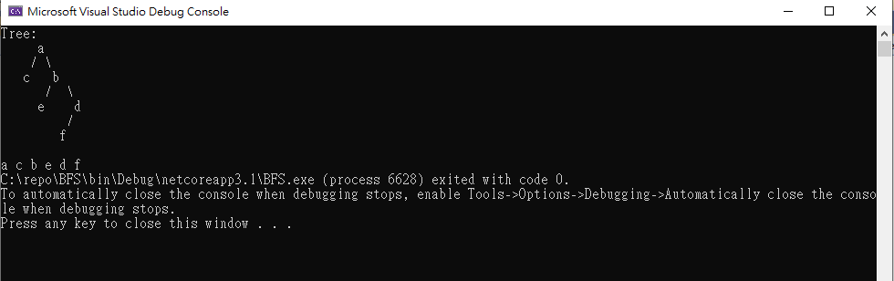

# BFS

This is an implementation of BFS and use Binary Tree.

<table>
  <tr>
      <td>
        method
      </td>
      <td>
        description
      </td>
  </tr>
    <tr>
      <td>
        Traverse
      </td>
      <td>
        BFS Traverse
      </td>
  </tr>
</table>

### demo

