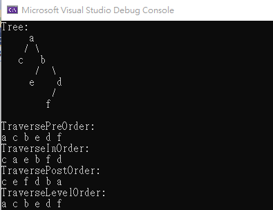

# BinaryTree

This is a implementation of BinaryTree,using DFS.

<table>
  <tr>
      <td>
        method
      </td>
      <td>
        description
      </td>
  </tr>
    <tr>
      <td>
        TraversePreOrder
      </td>
      <td>
      Print the data when the node visit 
      Visit the root 
       Traverse the left subtree 
     Traverse the right subtree 
      </td>
  </tr>
  <tr>
      <td>
        TraverseInOrder
      </td>
      <td>
      Print the data from the left back 
        Traverse the left subtree 
        Visit the root 
        Traverse the right subtree 
      </td>
  </tr>
  <tr>
      <td>
        TraversePostOrder
      </td>
      <td>
      Print the data from the right back 
       Traverse the left subtree 
       Traverse the right subtree 
        Visit the root 
      </td>
  </tr>
</table>

### demo

