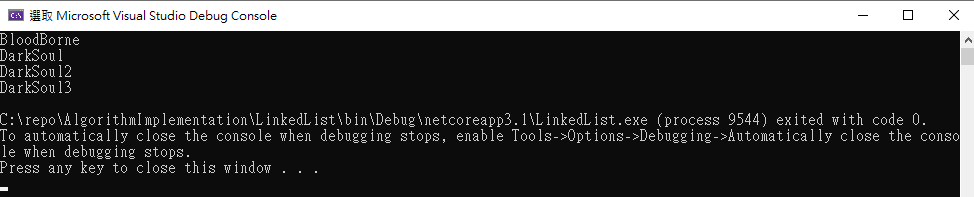

# LinkedList
This is an implementation of LinkedList.

<table>
  <tr>
      <td>
        method
      </td>
       <td>
        Big-O
      </td>
      <td>
        description
      </td>
  </tr>
    <tr>
      <td>
        PushFront
      </td>
       <td>
        O(1)
      </td>
      <td>
      push a data to the front of linked list.
      </td>
  </tr>
  <tr>
      <td>
        PushBack
      </td>
       <td>
        O(n)
      </td>
      <td>
      push a data to the end of linked list.
      </td>
  </tr>
  <tr>
      <td>
        PrintAll
      </td>
       <td>
        O(n)
      </td>
      <td>
        travel and print all linked list data
      </td>
  </tr>
</table>

### demo

