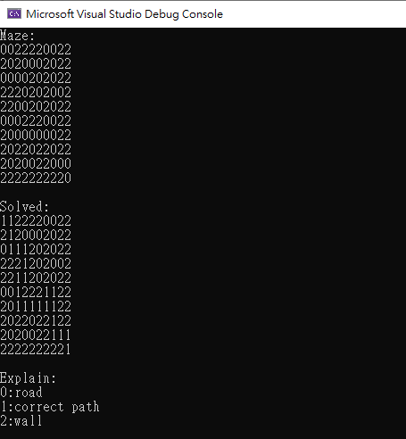

# RecursiveMaze

This is an implementation of RecursiveMaze.

<table>
  <tr>
      <td>
        method
      </td>
      <td>
        description
      </td>
  </tr>
    <tr>
      <td>
        printMaze
      </td>
      <td>
      Print the maze 
      </td>
  </tr>
   <tr>
      <td>
        solveMaze
      </td>
      <td>
      Solve and print the maze 
      </td>
  </tr>
</table>

### demo

